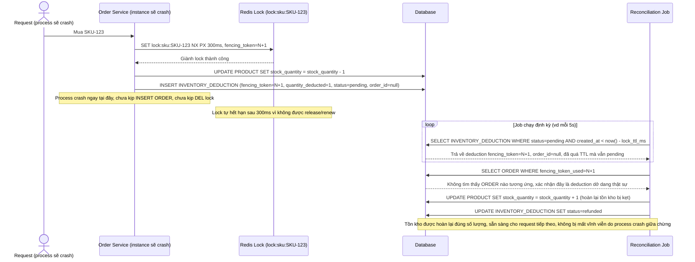

# Enhance sequence — Reconcile tồn kho bị kẹt khi process crash giữa chừng

Đây là **enhance**, flow hoàn toàn mới xử lý trường hợp process giữ lock crash ngay sau khi đã trừ tồn kho trong DB nhưng chưa kịp tạo `ORDER`/release lock. Đáp ứng yêu cầu 2: phát hiện trạng thái dở dang này khi lock hết hạn (đối chiếu số đã trừ với đơn hàng tồn tại tương ứng), để hoàn lại tồn kho bị kẹt thay vì mất vĩnh viễn.

