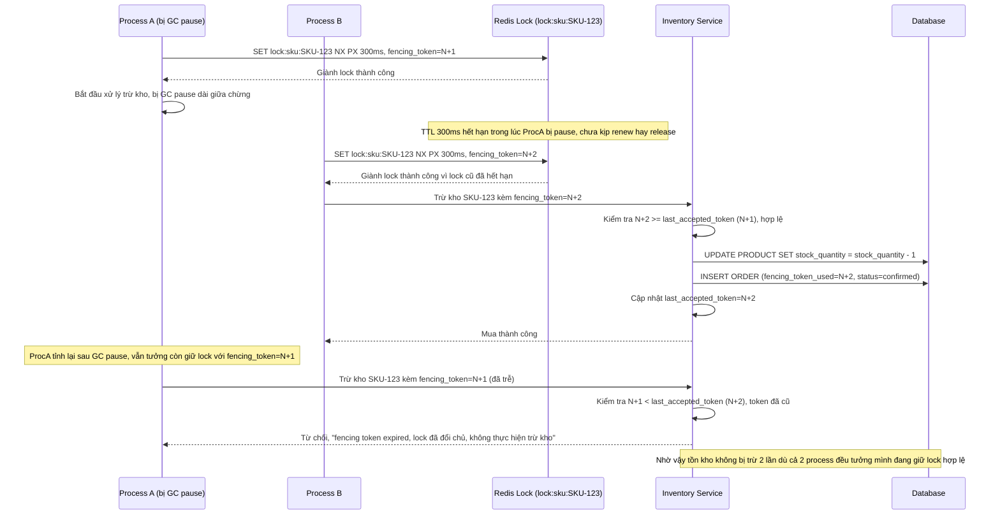

# Enhance sequence — Fencing token chặn ghi trừ kho từ process đã mất lock

Đây là **enhance**, flow hoàn toàn mới xử lý trường hợp process bị GC pause/network delay tưởng mình còn giữ lock. Đáp ứng yêu cầu 3: dùng fencing token gắn với lock để tránh process bị treo ghi trừ kho sau khi lock đã hết hạn và bị process khác giành mất — thao tác trừ kho với token cũ phải bị inventory service từ chối.

