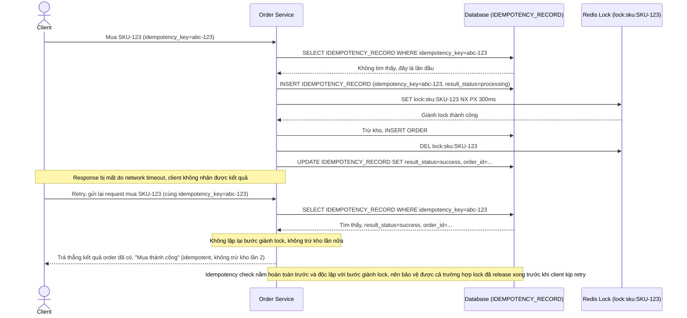

# Enhance sequence — Idempotency key chống trừ kho 2 lần khi client retry

Đây là **enhance**, flow hoàn toàn mới xử lý trường hợp client retry do timeout network. Đáp ứng yêu cầu 5: lock chỉ đảm bảo tuần tự xử lý chứ không đảm bảo request không bị gửi lặp, nên cần idempotency key gắn với request mua hàng, độc lập hoàn toàn với cơ chế lock, để đảm bảo retry không gây trừ kho 2 lần cho cùng 1 yêu cầu.

