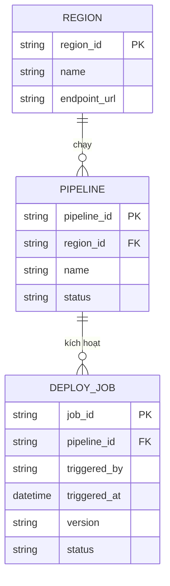

# ERD - Base (trước khi có distributed lock điều phối deploy)

Đây là trạng thái **base**: nền tảng SaaS chạy CI/CD ở 3 region, mỗi region có pipeline deploy riêng, nhưng **chưa có cơ chế khoá toàn cục** nào ràng buộc các pipeline lẫn nhau. Mỗi region tự quyết định khi nào deploy, không biết region khác đang deploy hay không - đây chính là tiền đề khiến đề bài (enhance) cần thêm distributed lock.

