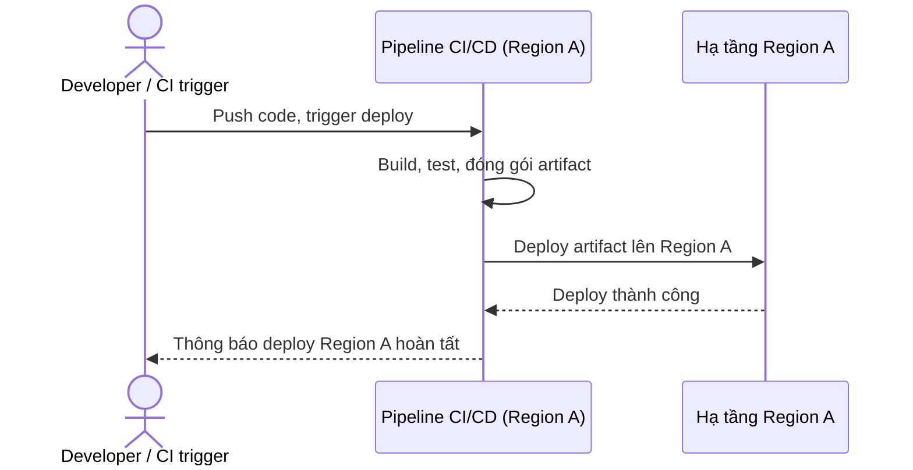

# Sequence Diagram - Base: trigger-deploy

Đây là flow **base**: một pipeline CI/CD ở 1 region được trigger (do commit hoặc thao tác thủ công) và deploy thẳng lên hạ tầng của region đó, không hề kiểm tra hay xin phép bất kỳ ai. Flow này là nền để so sánh với enhance, vì enhance sẽ chèn bước xin lock trước khi cho phép bước deploy thật sự chạy.

