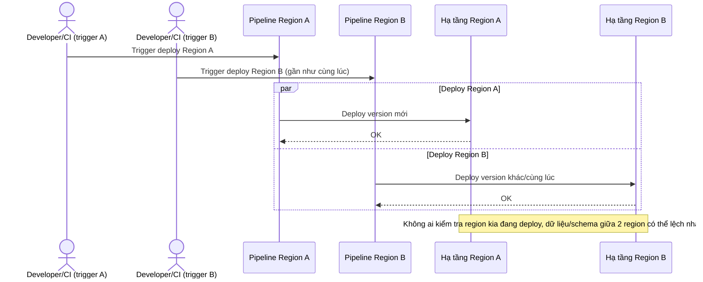

# Sequence Diagram - Base: concurrent-deploy-conflict

Đây là flow **base** minh hoạ chính vấn đề mà đề bài muốn giải quyết: khi 2 pipeline ở 2 region khác nhau bị trigger gần như đồng thời, cả 2 đều deploy song song vì không có cơ chế nào ngăn cản, dẫn tới trạng thái không đồng nhất giữa các region (ví dụ region A đã lên version mới, region B vẫn đang deploy version khác gây lệch dữ liệu/schema). Flow này là lý do enhance cần một distributed lock toàn cục.

