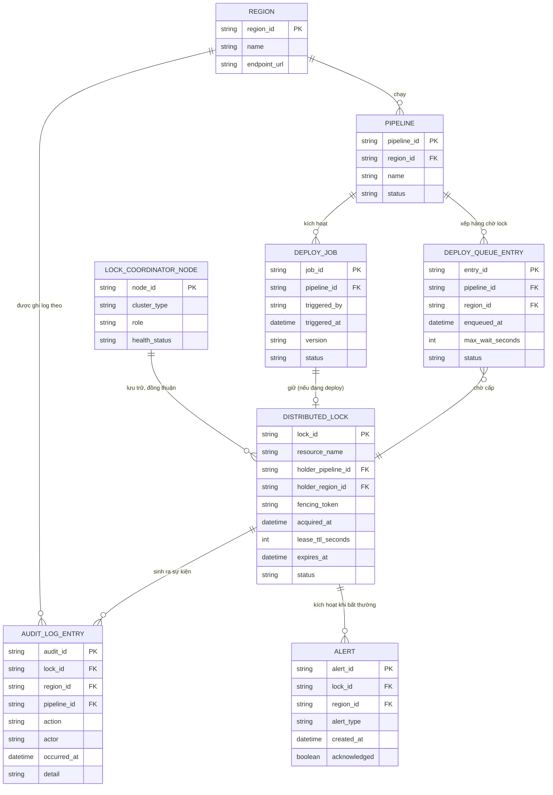

# ERD - Enhance (có distributed lock điều phối deploy đa vùng)

Đây là trạng thái **enhance**: sau khi áp đề bài, giữ nguyên `REGION`, `PIPELINE`, `DEPLOY_JOB` từ base, thêm mới:
- `DISTRIBUTED_LOCK`: đại diện cho lock toàn cục đặt trên coordinator chịu lỗi cao (ZooKeeper/etcd ensemble), có `lease_ttl_seconds`/`expires_at` để tự hết hạn nếu pipeline treo, và `fencing_token` để region không thể "tự cho là an toàn" nếu token không khớp - đáp ứng yêu cầu 1, 2 và 4.
- `LOCK_COORDINATOR_NODE`: các node trong ensemble/cluster (ZK hoặc etcd), độc lập với mọi region, dùng để thể hiện tính chịu lỗi cao (quorum) của coordinator - đáp ứng yêu cầu 1.
- `DEPLOY_QUEUE_ENTRY`: hàng đợi pipeline đang chờ lock, có `max_wait_seconds` và `status` để xử lý timeout khi chờ quá lâu - đáp ứng yêu cầu 5.
- `AUDIT_LOG_ENTRY`: ghi lại toàn bộ vòng đời của lock và deploy (region nào, ai trigger, lúc nào) phục vụ rollback/điều tra - đáp ứng yêu cầu 3.
- `ALERT`: cảnh báo cho người vận hành khi lock bị treo quá hạn, khi coordinator mất kết nối, hoặc khi queue timeout - đáp ứng yêu cầu 2, 4 và 5.

