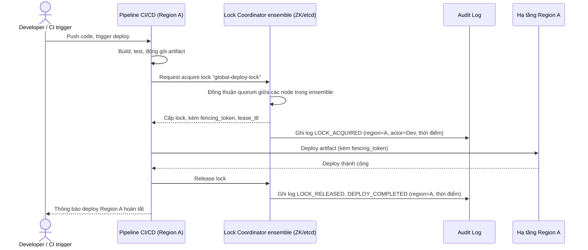

# Sequence Diagram - Enhance: trigger-deploy

Đây là flow **enhance** của `trigger-deploy` (so với base ở file `2-base-trigger-deploy-sqd.md`): trước khi deploy thật, pipeline phải xin lock toàn cục từ coordinator ensemble (ZooKeeper/etcd, chịu lỗi cao, độc lập với mọi region), chỉ khi acquire thành công mới được deploy, và toàn bộ vòng đời lock/deploy đều được audit log lại. Đáp ứng yêu cầu 1 (coordinator chịu lỗi cao, độc lập region) và yêu cầu 3 (audit đầy đủ region/thời điểm/người trigger).

