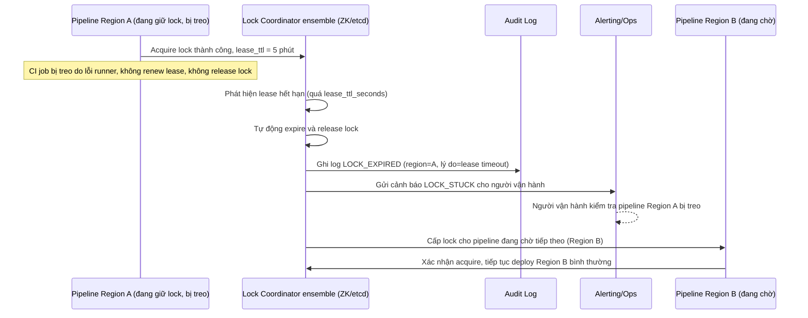

# Sequence Diagram - Enhance: lock-timeout-auto-release

Đây là flow **enhance mới**, chưa tồn tại ở base: khi pipeline giữ lock bị treo (CI lỗi, không renew lease) vượt quá `lease_ttl_seconds`, coordinator tự động hết hạn và nhả lock, đồng thời gửi cảnh báo cho người vận hành thay vì chặn các pipeline khác vô thời hạn. Đáp ứng yêu cầu 2.

