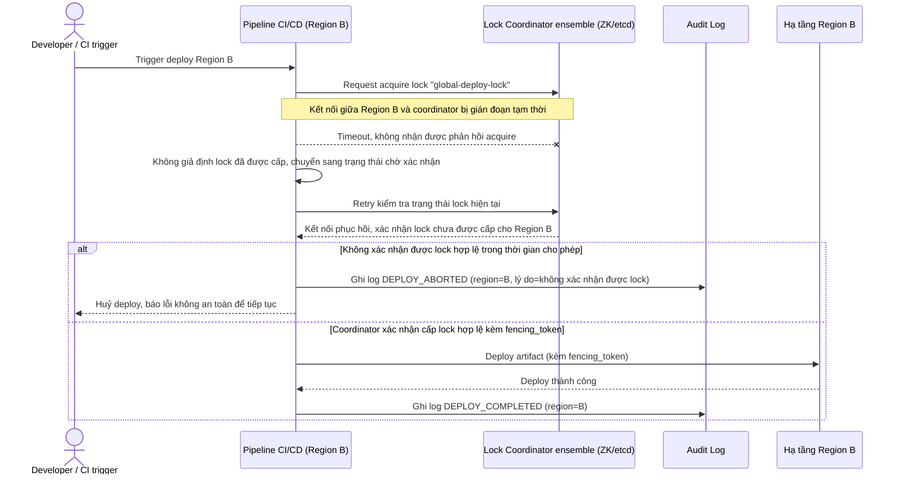

# Sequence Diagram - Enhance: coordinator-partition-safety

Đây là flow **enhance mới**: khi coordinator mất kết nối tạm thời với 1 region, pipeline ở region đó không được tự cho là "an toàn để deploy" chỉ vì không nhận được lỗi rõ ràng - nó phải chủ động xác nhận lock hợp lệ (qua fencing_token còn hiệu lực) trước khi tiến hành, và huỷ/tạm dừng nếu không xác nhận được. Đáp ứng yêu cầu 4.

