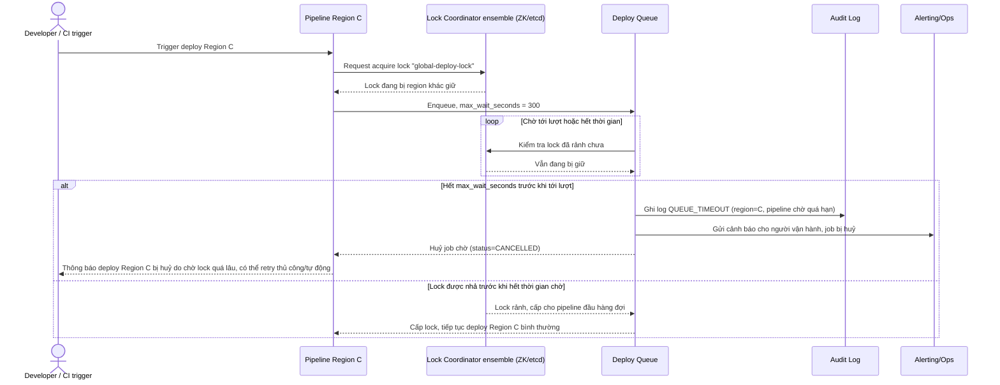

# Sequence Diagram - Enhance: queue-wait-timeout

Đây là flow **enhance mới**: khi lock đang bị pipeline khác giữ, pipeline mới phải xếp hàng chờ với `max_wait_seconds` xác định, nếu chờ vượt quá giới hạn thì job bị huỷ, có thông báo cho người trigger, và có thể được cấu hình để tự động retry sau đó. Đáp ứng yêu cầu 5.

