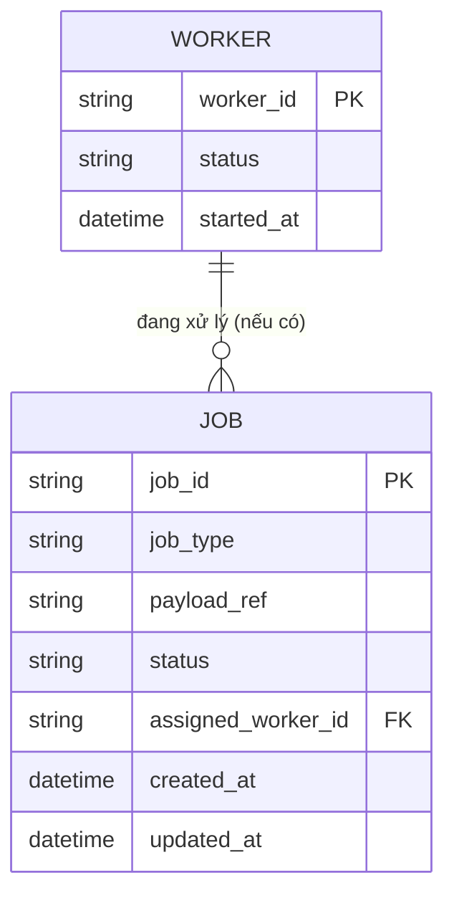

# ERD - Base (trước khi có distributed lock/lease cho job)

Đây là trạng thái **base**: có một hàng đợi công việc lớn (`JOB`) và nhiều `WORKER` chạy song song để xử lý, nhưng việc "ai nhận job nào" chỉ dựa vào cập nhật trạng thái đơn giản, chưa có lock/lease với TTL, chưa có cơ chế phát hiện worker chết. Đây là nền tối thiểu để enhance thêm cơ chế claim bằng lock có TTL, atomic claim, renew, graceful shutdown và dead job detection.

