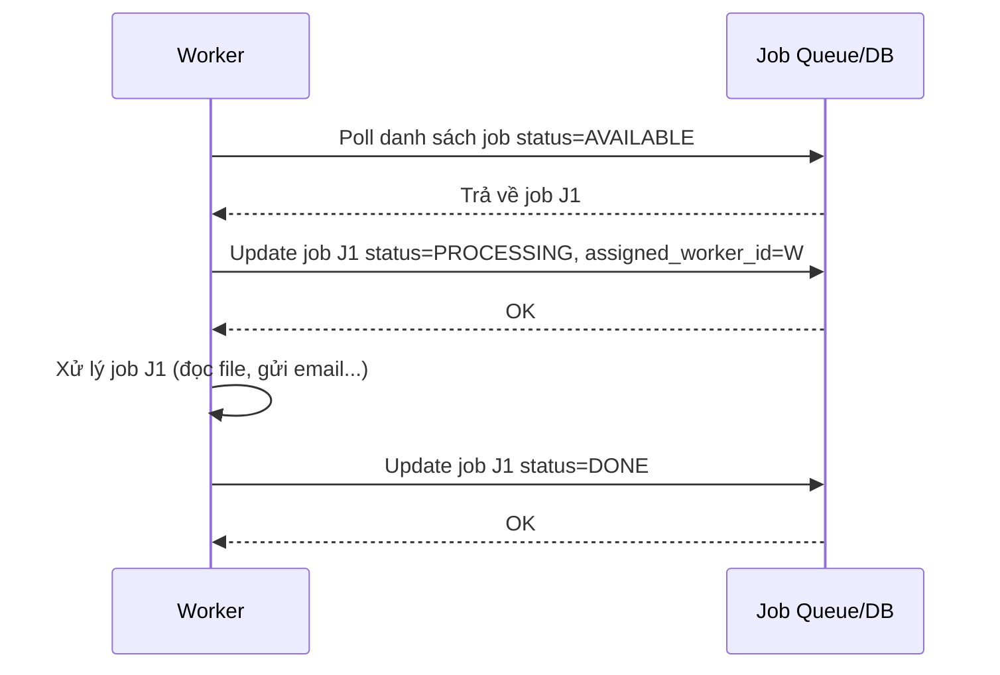

# Sequence Diagram - Base: claim-and-process-job

Đây là flow **base**: worker định kỳ poll hàng đợi, thấy job đang ở trạng thái "AVAILABLE" thì tự cập nhật thẳng thành "PROCESSING" rồi xử lý, không qua bất kỳ lock/lease nào. Flow này là nền để so sánh với enhance, nơi bước "claim" sẽ được thay bằng thao tác atomic có TTL để tránh 2 worker cùng nhận 1 job.

