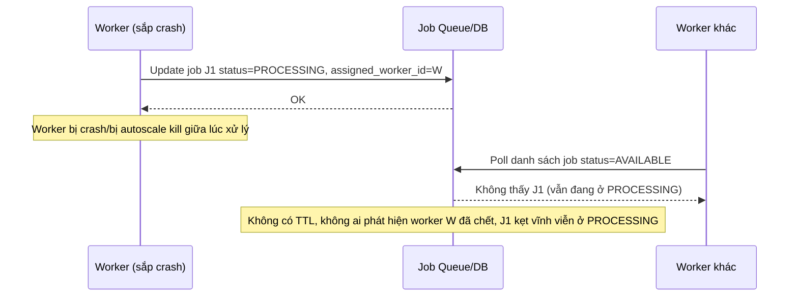

# Sequence Diagram - Base: worker-crash-job-stuck

Đây là flow **base** minh hoạ vấn đề chính mà đề bài cần giải quyết: khi worker đang xử lý job mà crash (hoặc bị autoscale kill) giữa chừng, job vẫn nằm ở trạng thái "PROCESSING" mãi mãi vì không có TTL/lease nào theo dõi, không worker nào khác dám nhận lại, job bị kẹt vĩnh viễn. Đây là lý do enhance cần TTL tự động trả job về "AVAILABLE" và cơ chế dead job detection.

