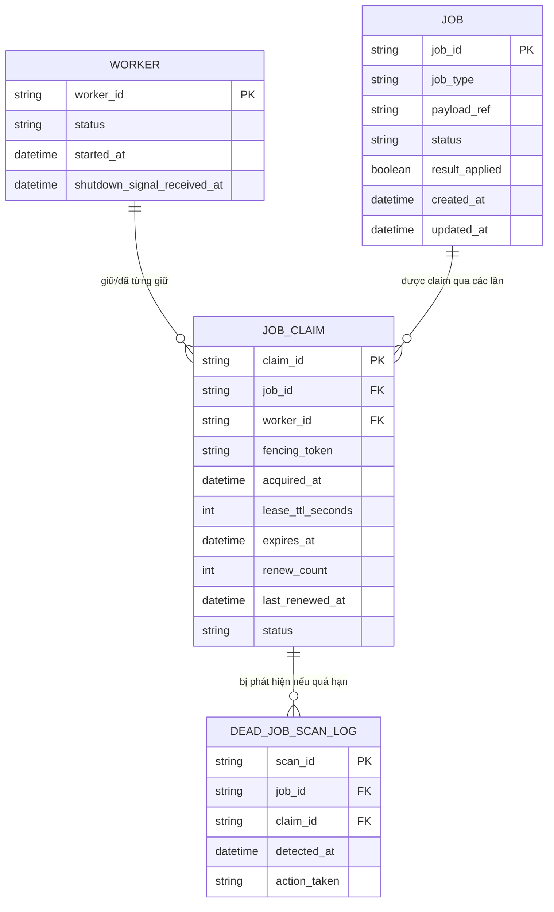

# ERD - Enhance (claim bằng lock/lease có TTL cho job)

Đây là trạng thái **enhance**: giữ nguyên `JOB`, `WORKER` từ base (JOB bỏ field `assigned_worker_id` trực tiếp, thay bằng quan hệ tới `JOB_CLAIM`), thêm mới:
- `JOB_CLAIM`: đại diện cho lock/lease theo từng job, có `fencing_token`, `lease_ttl_seconds`, `expires_at` để tự động hết hạn khi worker chết mà không release - đáp ứng yêu cầu 1; có `status` (HELD/RELEASED/EXPIRED) để phân biệt worker thắng/thua khi race - đáp ứng yêu cầu 2; có `renew_count`/`last_renewed_at` để theo dõi renew định kỳ - đáp ứng yêu cầu 3.
- `JOB` thêm field `result_applied` (idempotency marker) để kiểm tra trước khi ghi kết quả, tránh áp dụng 2 lần khi có worker khác nhận lại job - đáp ứng yêu cầu 3.
- `WORKER` thêm field `shutdown_signal_received_at` để thể hiện graceful shutdown chủ động release job - đáp ứng yêu cầu 4.
- `DEAD_JOB_SCAN_LOG`: bản ghi mỗi lần cơ chế quét định kỳ phát hiện job "đang xử lý" quá lâu so với TTL kỳ vọng - đáp ứng yêu cầu 5.

