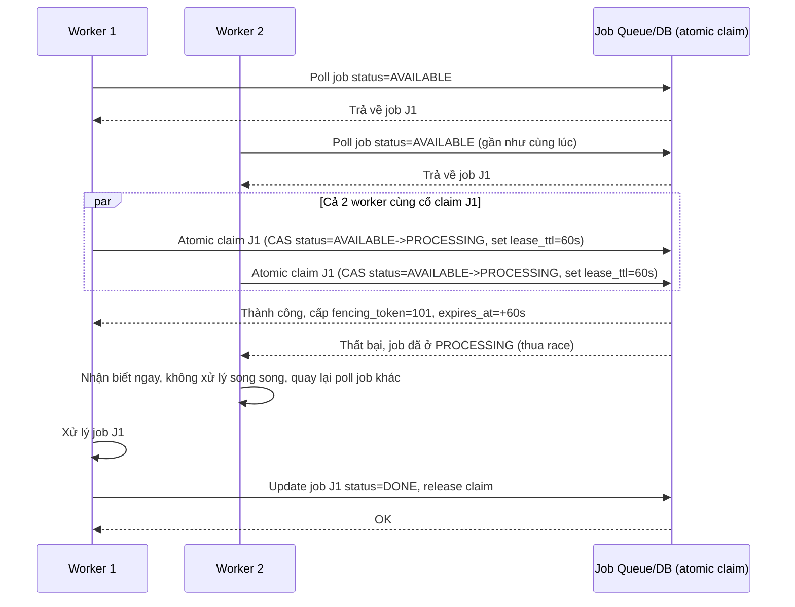

# Sequence Diagram - Enhance: claim-and-process-job

Đây là flow **enhance** của `claim-and-process-job` (so với base ở file `2-base-claim-and-process-job-sqd.md`): 2 worker cùng thấy job "AVAILABLE" và cùng cố acquire lock/lease gần như đồng thời (race condition khi liệt kê job không atomic với acquire), nhưng thao tác claim thực tế là 1 lệnh atomic (compare-and-swap trên trạng thái job hoặc acquire trên coordinator) nên chỉ đúng 1 worker thắng và có TTL ngay từ lúc claim. Đáp ứng yêu cầu 1 (claim bằng lock/lease có TTL) và yêu cầu 2 (race condition chỉ 1 worker thắng, worker thua nhận biết ngay).

