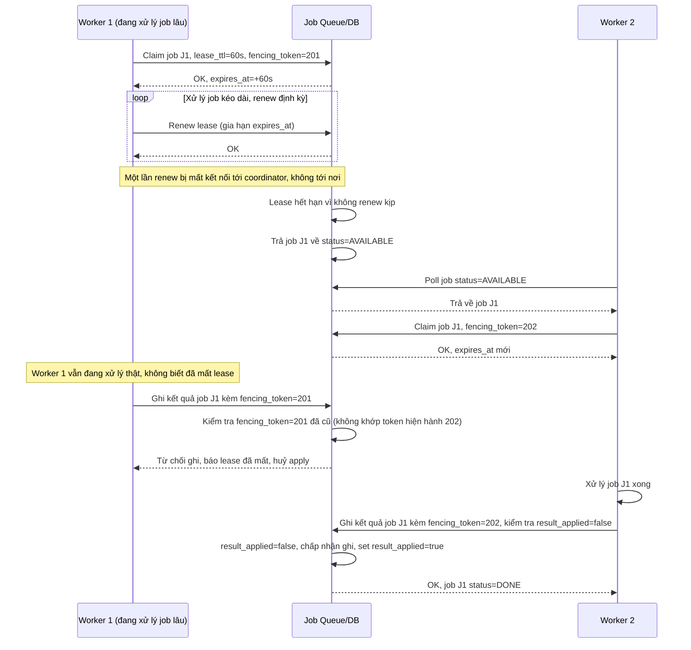

# Sequence Diagram - Enhance: lease-renew-and-idempotent-apply

Đây là flow **enhance mới**: job cần xử lý lâu hơn TTL ước tính (file lớn bất thường), worker phải renew lease định kỳ; lần renew giữa chừng thất bại do mất kết nối coordinator, lease hết hạn, worker khác nhận lại job trong khi worker cũ vẫn đang xử lý thật. Khi cả 2 cùng cố ghi kết quả, cơ chế kiểm tra idempotent (dựa trên `result_applied`/fencing_token) đảm bảo kết quả chỉ được áp dụng đúng 1 lần. Đáp ứng yêu cầu 3.

