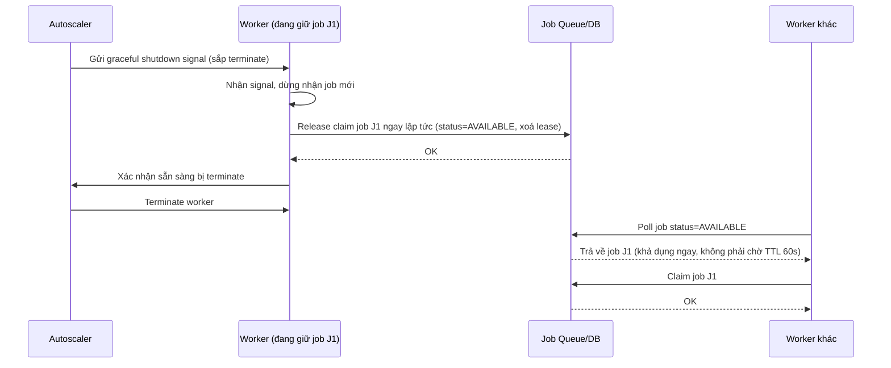

# Sequence Diagram - Enhance: graceful-shutdown-release

Đây là flow **enhance mới**: khi worker nhận tín hiệu terminate có báo trước từ autoscale (graceful shutdown signal, ví dụ SIGTERM), worker chủ động release ngay lock/job đang giữ thay vì để coordinator chờ tới khi TTL hết hạn, giúp job khả dụng lại nhanh hơn nhiều so với chờ timeout tự nhiên. Đáp ứng yêu cầu 4.

