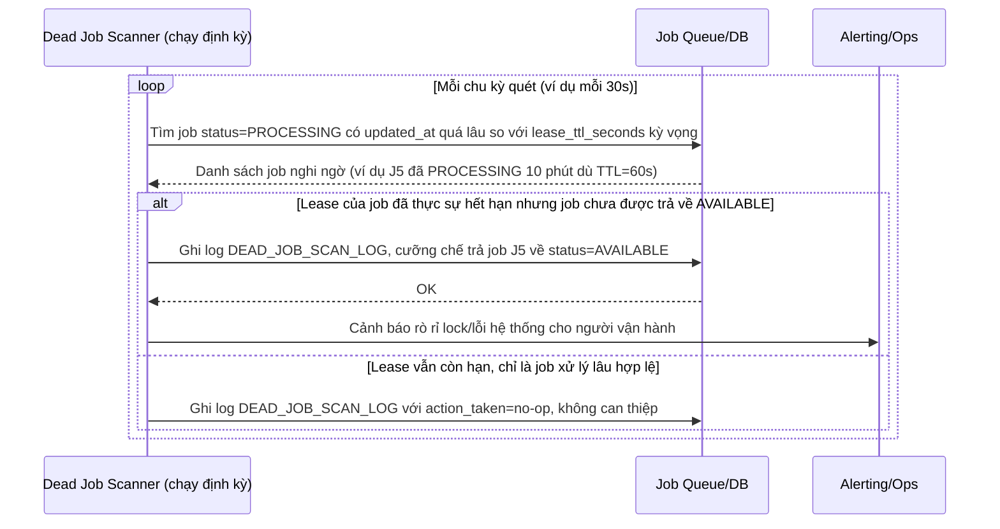

# Sequence Diagram - Enhance: dead-job-scan

Đây là flow **enhance mới**: một tiến trình quét định kỳ (dead job scanner) chủ động rà soát các job đang ở trạng thái "PROCESSING" quá lâu so với TTL kỳ vọng, thay vì chỉ dựa hoàn toàn vào cơ chế TTL tự nhiên - dùng để phát hiện sớm rò rỉ lock hoặc lỗi hệ thống (ví dụ TTL không tự expire được do bug, clock skew). Đáp ứng yêu cầu 5.

