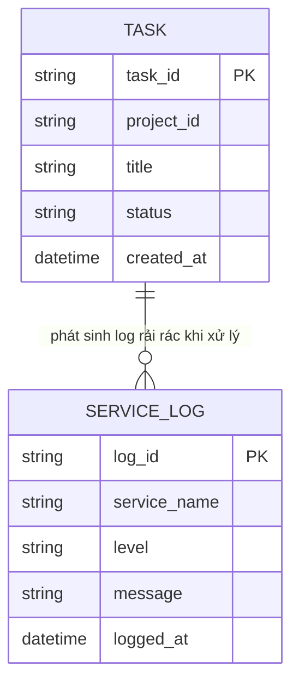

# ERD - Base (trước khi có distributed tracing)

Đây là trạng thái **base**: nền tảng SaaS quản lý dự án đã có luồng tạo `TASK` đi qua nhiều service (`api-gateway`, `task-service`, `notification-service`, `search-indexer`), mỗi service tự ghi log cục bộ khi xử lý, nhưng **không có bất kỳ định danh chung nào** nối các log của cùng 1 request lại với nhau. Đây là tiền đề khiến enhance cần thêm `trace_id`/`span` để dựng lại được toàn bộ hành trình của 1 request.

