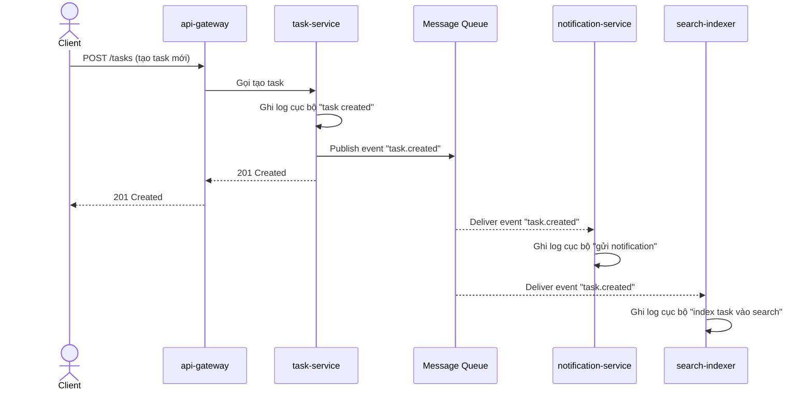

# Sequence Diagram - Base: create-task

Đây là flow **base**: request tạo task đi qua `api-gateway` -> `task-service` -> `notification-service` -> `search-indexer` (bất đồng bộ qua message queue), mỗi service chỉ ghi log cục bộ của riêng nó, không kèm bất kỳ ID chung nào. Flow này là nền để so sánh với enhance, nơi mỗi bước sẽ được gắn `trace_id`/`span` xuyên suốt.

