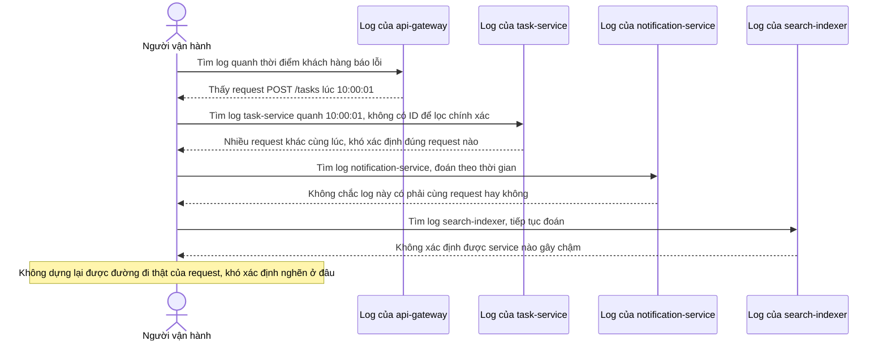

# Sequence Diagram - Base: debug-slow-request

Đây là flow **base** minh hoạ chính vấn đề mà đề bài cần giải quyết: khi khách hàng báo request tạo task bị chậm, người vận hành phải tự tra log rời rạc trên từng service theo timestamp gần đúng và đoán mò, vì không có `trace_id` nào nối các log của cùng 1 request. Đây là lý do enhance cần distributed tracing.

