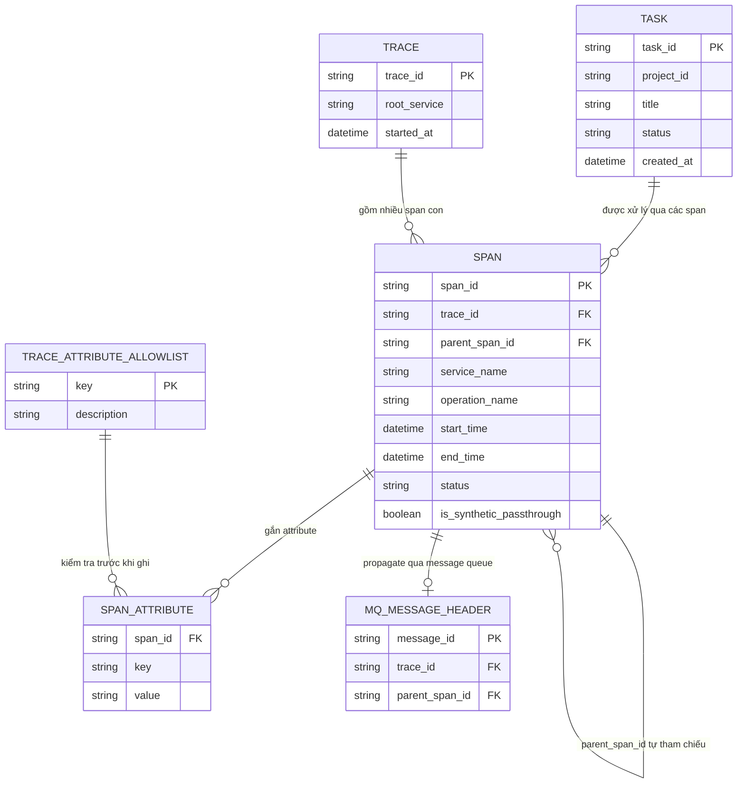

# ERD - Enhance (distributed tracing xuyên các service)

Đây là trạng thái **enhance**: giữ nguyên `TASK` từ base, thay `SERVICE_LOG` rời rạc bằng mô hình tracing có cấu trúc:
- `TRACE`: đại diện cho toàn bộ hành trình 1 request, có `trace_id` sinh ở gateway (hoặc nhận từ client) - đáp ứng yêu cầu 1.
- `SPAN`: mỗi service tạo 1 span con gắn `trace_id` gốc và `parent_span_id`, có `is_synthetic_passthrough` để đánh dấu đoạn đi qua service không hỗ trợ tracing (chỉ pass-through header, không có span chi tiết) - đáp ứng yêu cầu 2 và 3. Span tự chứa đủ thông tin (`trace_id`, `span_id`, `start_time`, `end_time`, `status`) để đứng độc lập, không phụ thuộc thứ tự nhận - đáp ứng yêu cầu 5.
- `SPAN_ATTRIBUTE`: cặp key/value gắn vào span, chỉ được ghi nếu `key` nằm trong `TRACE_ATTRIBUTE_ALLOWLIST` - đáp ứng yêu cầu 4.
- `TRACE_ATTRIBUTE_ALLOWLIST`: danh sách các attribute key được phép ghi vào trace, dùng để lọc trước khi ghi `SPAN_ATTRIBUTE`, ngăn rò rỉ password/token - đáp ứng yêu cầu 4.
- `MQ_MESSAGE_HEADER`: đại diện cho việc propagate `trace_id`/`parent_span_id` qua header của message queue khi gọi bất đồng bộ - đáp ứng yêu cầu 1.

