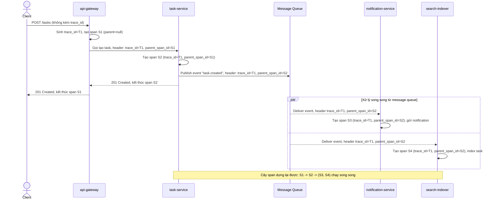

# Sequence Diagram - Enhance: create-task

Đây là flow **enhance** của `create-task` (so với base ở file `2-base-create-task-sqd.md`): `api-gateway` sinh `trace_id` nếu client chưa gửi, mỗi service tạo span con gắn `parent_span_id` đúng (kể cả khi `notification-service` và `search-indexer` được gọi song song qua message queue), và `trace_id`/`parent_span_id` được propagate qua cả header HTTP lẫn header của message queue. Đáp ứng yêu cầu 1 (propagate trace_id qua header, kể cả async qua MQ) và yêu cầu 2 (mỗi service tạo span con đúng quan hệ cha-con, kể cả gọi song song).

