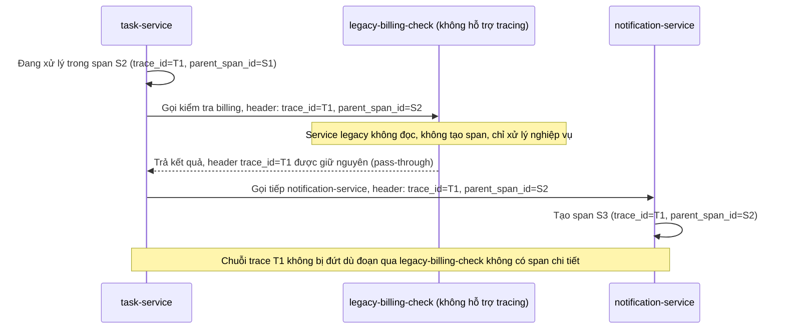

# Sequence Diagram - Enhance: legacy-service-passthrough

Đây là flow **enhance mới**: `task-service` gọi thêm một service bên thứ ba đã cũ (`legacy-billing-check`) không hỗ trợ tracing, không tạo span nào cả, nhưng vẫn nhận và trả lại nguyên vẹn header `trace_id` (pass-through) để chuỗi trace không bị đứt quãng khi các service tiếp theo tiếp tục xử lý. Đáp ứng yêu cầu 3.

