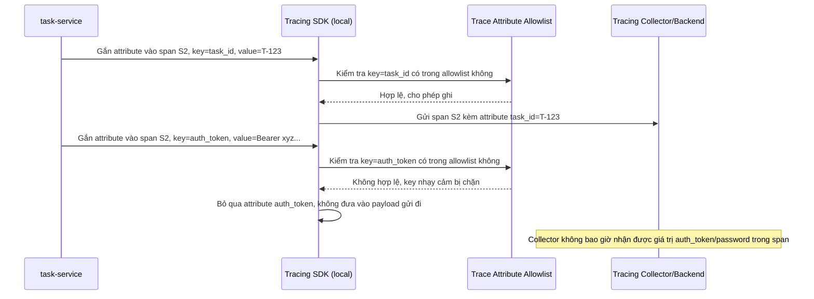

# Sequence Diagram - Enhance: sensitive-attribute-allowlist

Đây là flow **enhance mới**: khi `task-service` gắn attribute vào span (ví dụ thông tin request), tracing SDK kiểm tra từng key với `TRACE_ATTRIBUTE_ALLOWLIST` trước khi ghi - key hợp lệ như `task_id`, `project_id` được ghi bình thường, còn key nhạy cảm như `auth_token`/`password` bị chặn, không bao giờ xuất hiện trong tên span hay tag. Đáp ứng yêu cầu 4.

