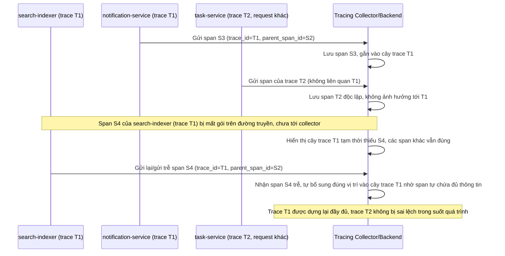

# Sequence Diagram - Enhance: late-or-dropped-span

Đây là flow **enhance mới**: mỗi span được gửi độc lập tới collector (không phụ thuộc thứ tự nhận), nên khi span của `search-indexer` cho trace T1 bị gửi trễ do network drop, collector vẫn dựng đúng cây trace của T1 ngay khi span tới muộn, và trace T2 của 1 request khác xử lý song song hoàn toàn không bị ảnh hưởng. Đáp ứng yêu cầu 5.

