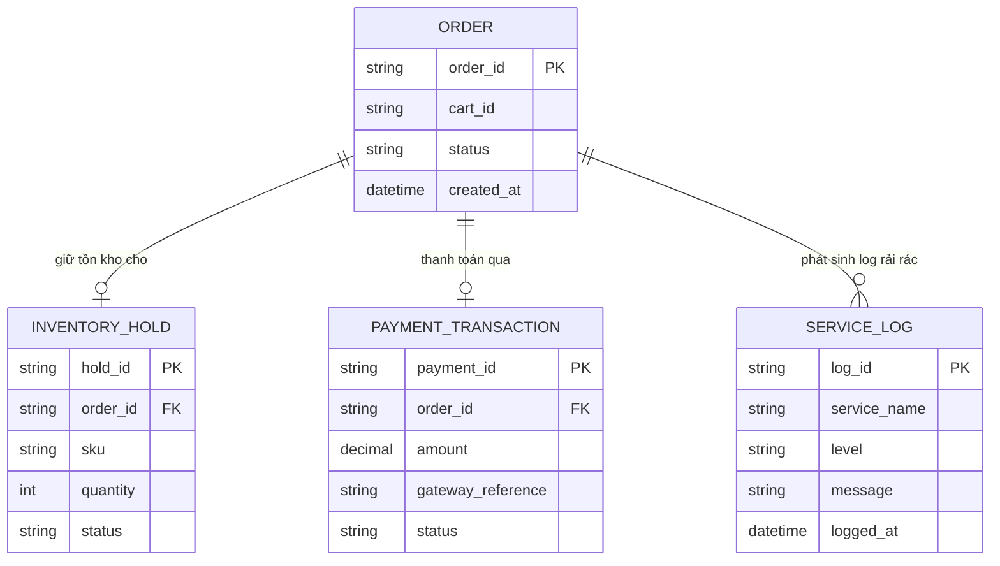

# ERD - Base (trước khi có distributed tracing)

Đây là trạng thái **base**: sàn e-commerce đã có luồng đặt hàng đi qua 4 service tách biệt (`cart-service`, `inventory-service`, `payment-service`, `order-confirmation-service`), có các entity nghiệp vụ cốt lõi là `ORDER`, `INVENTORY_HOLD` (giữ tồn kho) và `PAYMENT_TRANSACTION`, nhưng mỗi service chỉ ghi log cục bộ, không có định danh chung nối các bước lại với nhau. Đây là tiền đề khiến enhance cần thêm tracing để chỉ ra chính xác bước nào đang là nút thắt.

