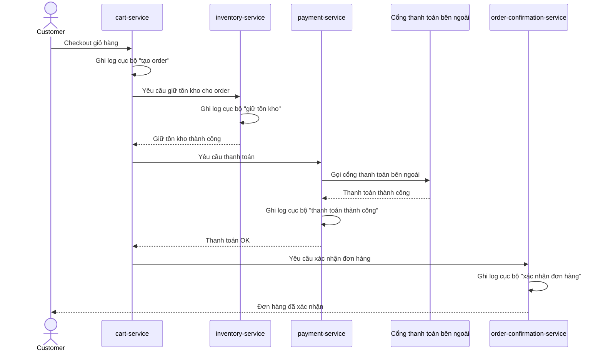

# Sequence Diagram - Base: checkout-order

Đây là flow **base**: đơn hàng đi qua `cart-service` -> `inventory-service` -> `payment-service` (gọi cổng thanh toán bên ngoài) -> `order-confirmation-service`, mỗi service chỉ ghi log cục bộ của riêng nó. Flow này là nền để so sánh với enhance, nơi mỗi bước sẽ được gắn `trace_id`/`span` xuyên suốt kể cả đoạn chờ callback bất đồng bộ.

