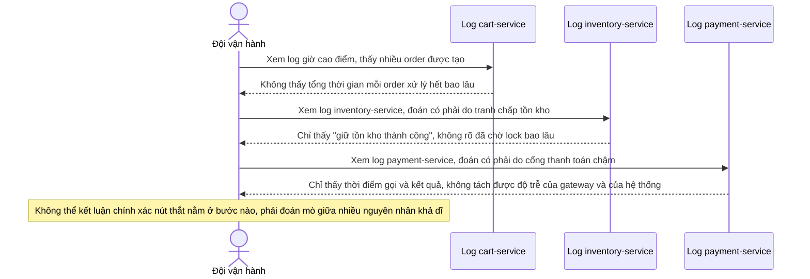

# Sequence Diagram - Base: diagnose-slow-checkout

Đây là flow **base** minh hoạ chính vấn đề mà đề bài cần giải quyết: vào giờ cao điểm, checkout bị chậm nhưng đội vận hành không có cách nào xác định chính xác nguyên nhân - có thể do tồn kho bị lock tranh chấp, cổng thanh toán bên ngoài chậm, hay chỉ đơn giản hàng đợi nội bộ nghẽn - vì log của từng service không liên kết với nhau và không tách được thời gian chờ khỏi thời gian xử lý thật. Đây là lý do enhance cần tracing chi tiết theo từng bước.

