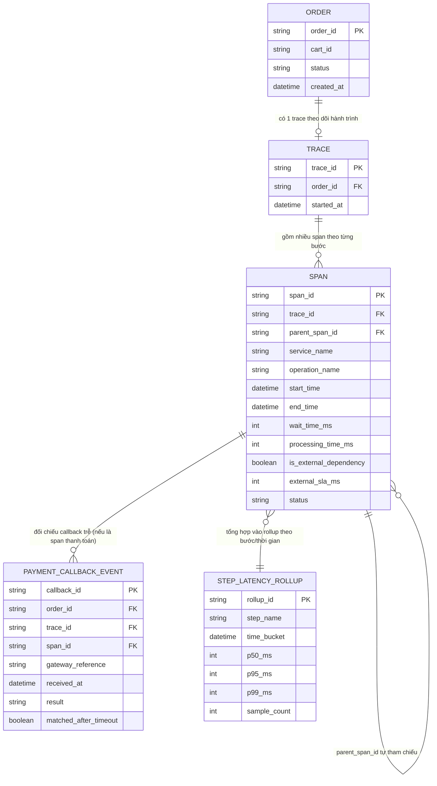

# ERD - Enhance (distributed tracing xuyên checkout, tách nguyên nhân nghẽn)

Đây là trạng thái **enhance**: giữ nguyên `ORDER`, `INVENTORY_HOLD`, `PAYMENT_TRANSACTION` từ base, thay `SERVICE_LOG` rời rạc bằng mô hình tracing có cấu trúc:
- `TRACE`: mỗi order gắn 1 trace xuyên suốt 4 bước dù có bước chờ callback bất đồng bộ - đáp ứng yêu cầu 1.
- `SPAN`: mỗi bước là 1 span, tách riêng `wait_time_ms` (thời gian chờ lock/hàng đợi) và `processing_time_ms` (thời gian xử lý logic thật) để phân biệt "chậm vì tranh chấp" với "chậm vì code nặng" - đáp ứng yêu cầu 2; có `is_external_dependency` và `external_sla_ms` để đánh dấu bước gọi cổng thanh toán là phụ thuộc ngoài với SLA riêng - đáp ứng yêu cầu 3.
- `STEP_LATENCY_ROLLUP`: bảng tổng hợp độ trễ p50/p95/p99 theo từng bước theo khung thời gian, phục vụ dashboard toàn traffic (không theo từng order riêng lẻ) - đáp ứng yêu cầu 4.
- `PAYMENT_CALLBACK_EVENT`: ghi lại callback bất đồng bộ từ cổng thanh toán, liên kết ngược về span thanh toán qua `trace_id`/`span_id`, để đối chiếu khi order bị timeout nhưng cổng thanh toán thực ra đã xử lý thành công - đáp ứng yêu cầu 5.

