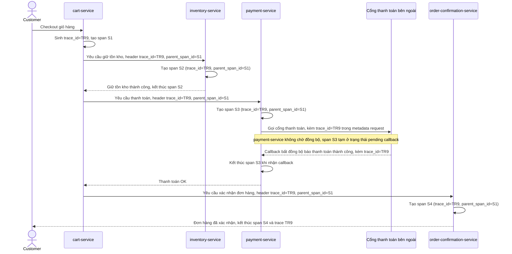

# Sequence Diagram - Enhance: checkout-order

Đây là flow **enhance** của `checkout-order` (so với base ở file `2-base-checkout-order-sqd.md`): `trace_id` được giữ nguyên xuyên suốt cả 4 bước, kể cả đoạn `payment-service` phải chờ callback bất đồng bộ từ cổng thanh toán thay vì trả lời đồng bộ ngay, giúp dựng lại được toàn bộ hành trình của 1 đơn hàng cụ thể khi khách hàng báo lỗi. Đáp ứng yêu cầu 1.

