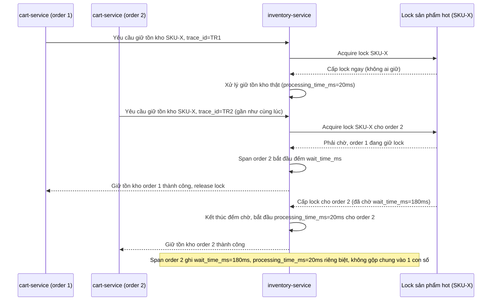

# Sequence Diagram - Enhance: inventory-lock-wait-vs-processing

Đây là flow **enhance mới**: hai order cùng tranh chấp giữ tồn kho cho cùng 1 sản phẩm hot, span của `inventory-service` tách rõ `wait_time_ms` (thời gian order 2 phải chờ lock được order 1 nhả) khỏi `processing_time_ms` (thời gian xử lý logic giữ tồn kho thật sự), giúp phân biệt "chậm vì tranh chấp tồn kho" với "chậm vì code xử lý nặng". Đáp ứng yêu cầu 2.

