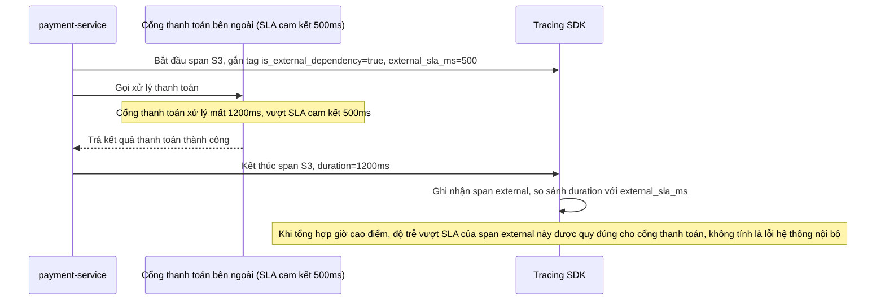

# Sequence Diagram - Enhance: payment-external-dependency

Đây là flow **enhance mới**: span của bước gọi cổng thanh toán được đánh dấu `is_external_dependency=true` kèm `external_sla_ms` riêng, để khi tổng hợp thống kê "checkout chậm ở bước nào" vào giờ cao điểm, đội vận hành phân biệt được độ trễ do cổng thanh toán đối tác (nằm ngoài tầm kiểm soát, so với SLA riêng của họ) và độ trễ do chính hệ thống nội bộ gây ra. Đáp ứng yêu cầu 3.

