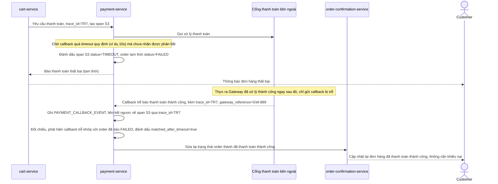

# Sequence Diagram - Enhance: payment-timeout-late-callback-reconciliation

Đây là flow **enhance mới**: order bị timeout ở bước chờ callback thanh toán và tạm thời được đánh dấu thất bại, nhưng cổng thanh toán thực ra đã xử lý thành công phía họ và gửi callback trễ sau đó. Nhờ span thanh toán và `PAYMENT_CALLBACK_EVENT` đều lưu đủ `trace_id`/`span_id`, hệ thống đối chiếu được callback trễ với đúng order để sửa lại trạng thái, tránh báo "thất bại" trong khi tiền đã bị trừ. Đáp ứng yêu cầu 5.

