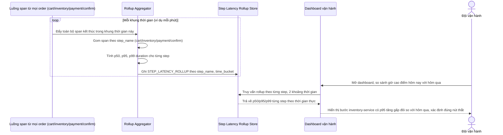

# Sequence Diagram - Enhance: realtime-latency-dashboard

Đây là flow **enhance mới**: một pipeline tổng hợp liên tục gom span từ toàn bộ order (không chỉ 1 order riêng lẻ) thành `STEP_LATENCY_ROLLUP` theo từng bước theo khung thời gian, để dashboard trả lời được câu hỏi "giờ cao điểm hôm nay chậm hơn hôm qua, chậm chủ yếu ở bước nào" bằng cách so sánh p50/p95/p99 theo thời gian thực. Đáp ứng yêu cầu 4.

