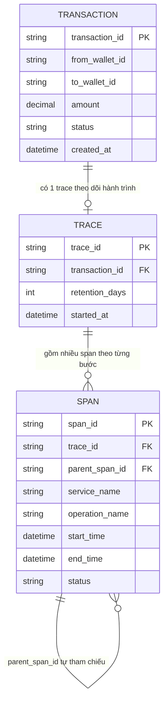

# ERD - Base (tracing thông thường, chưa đạt chuẩn audit)

Đây là trạng thái **base**: hệ thống chuyển tiền giữa các ví điện tử đã có luồng xử lý giao dịch qua `fraud-check`, `ledger-write`, `notification`, và đã dùng distributed tracing (`TRACE`/`SPAN`) như mọi hệ thống khác chỉ để phục vụ debug performance - áp dụng retention/sampling mặc định, span có thể bị ghi đè/sửa, chưa phân biệt external call, chưa có cảnh báo dừng bất thường, chưa đo overhead. Đây là tiền đề khiến enhance cần nâng cấp tracing này lên chuẩn audit trail cho compliance.

