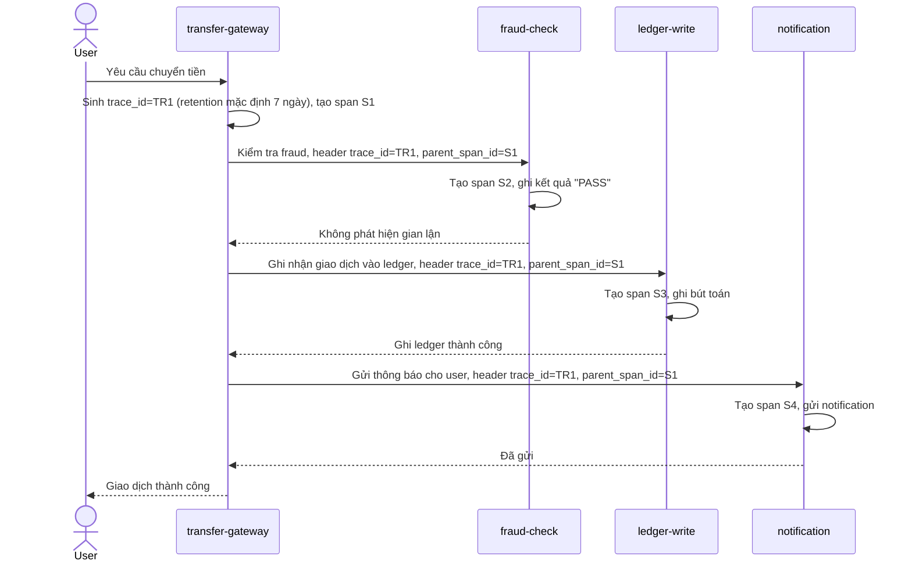

# Sequence Diagram - Base: process-transaction

Đây là flow **base**: giao dịch chuyển tiền đi qua `fraud-check` -> `ledger-write` -> `notification`, đã có tracing thông thường (mỗi bước tạo 1 span gắn `trace_id`), nhưng span được lưu theo policy retention/sampling mặc định như mọi trace khác, có thể bị ghi đè, không phân biệt gọi ra bên ngoài. Flow này là nền để so sánh với enhance, nơi trace của giao dịch tài chính sẽ được nâng cấp thành audit trail.

