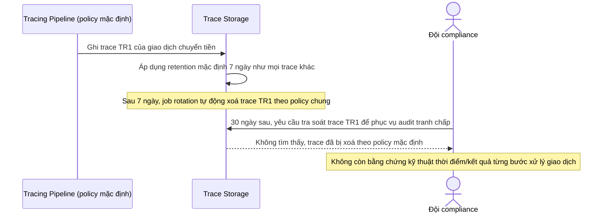

# Sequence Diagram - Base: trace-auto-deleted-by-retention-policy

Đây là flow **base** minh hoạ chính vấn đề mà đề bài cần giải quyết: vì trace của giao dịch tài chính dùng chung policy retention/sampling mặc định như mọi trace khác trong hệ thống, dữ liệu trace của 1 giao dịch bị rotation tự động xoá sau vài ngày; khi đội compliance cần tra soát lại một giao dịch cũ để phục vụ audit, dữ liệu đã không còn. Đây là lý do enhance cần retention riêng và đảm bảo toàn vẹn cho trace tài chính.

