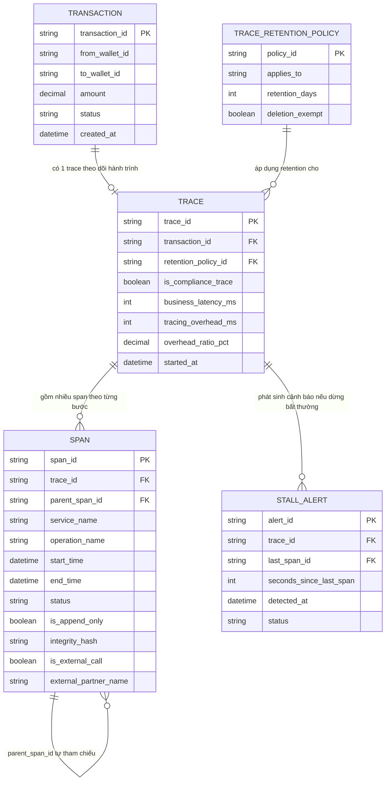

# ERD - Enhance (tracing nâng cấp thành audit trail cho fintech)

Đây là trạng thái **enhance**: giữ nguyên `TRANSACTION`, `TRACE`, `SPAN` từ base, thêm/sửa:
- `TRACE` thêm `is_compliance_trace` và liên kết `TRACE_RETENTION_POLICY` để có retention dài hơn trace thông thường, không bị xoá theo policy sampling/rotation mặc định - đáp ứng yêu cầu 1. Thêm `business_latency_ms`/`tracing_overhead_ms`/`overhead_ratio_pct` để đo tỉ lệ overhead do tracing gây ra so với latency gốc - đáp ứng yêu cầu 5.
- `SPAN` thêm `is_append_only` và `integrity_hash` để đảm bảo span kiểm tra fraud không sửa được sau khi ghi - đáp ứng yêu cầu 2; thêm `is_external_call`/`external_partner_name` để đánh dấu rõ bước gọi ngân hàng đối tác, tách biệt khỏi SLA nội bộ - đáp ứng yêu cầu 3.
- `TRACE_RETENTION_POLICY`: bảng chính sách retention, phân biệt COMPLIANCE (retention dài, không tự xoá) và STANDARD (retention mặc định) - đáp ứng yêu cầu 1.
- `STALL_ALERT`: cảnh báo tự động khi trace "dừng bất thường" giữa chừng, không có span tiếp theo trong X giây kể từ span cuối - đáp ứng yêu cầu 4.

