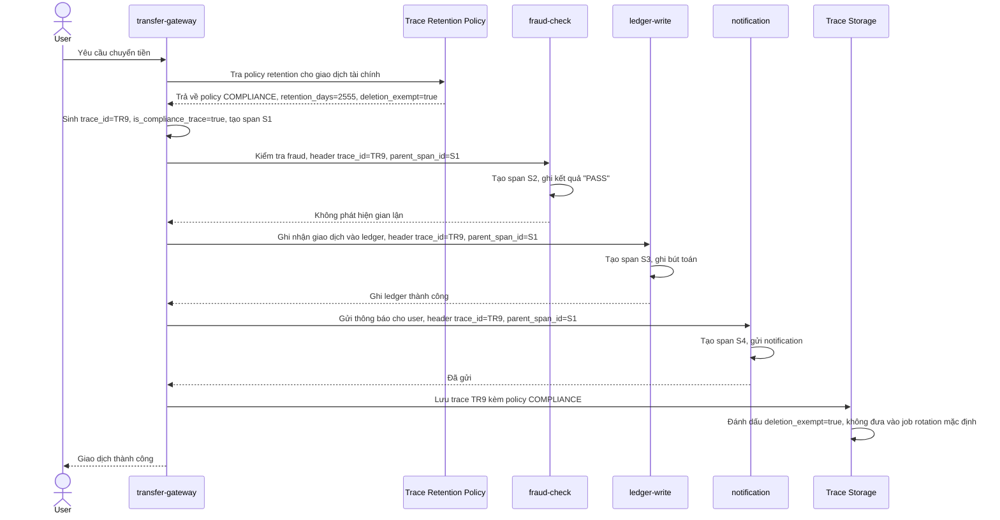

# Sequence Diagram - Enhance: process-transaction

Đây là flow **enhance** của `process-transaction` (so với base ở file `2-base-process-transaction-sqd.md`): ngay khi tạo trace, `transfer-gateway` gắn `is_compliance_trace=true` và tra `TRACE_RETENTION_POLICY` loại COMPLIANCE để áp retention dài hơn (ví dụ 7 năm) thay vì dùng retention mặc định 7 ngày, đảm bảo trace không bị job rotation/sampling mặc định xoá mất. Đáp ứng yêu cầu 1.

