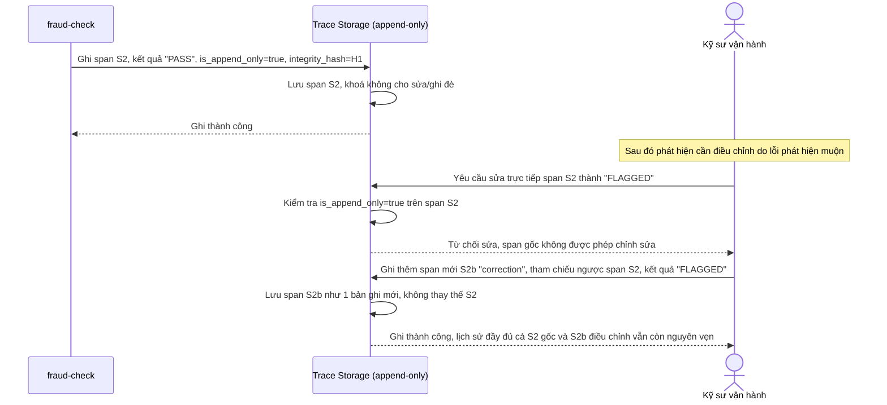

# Sequence Diagram - Enhance: fraud-check-append-only

Đây là flow **enhance mới**: span của bước kiểm tra fraud được ghi kèm `integrity_hash` và đánh dấu `is_append_only=true`; khi có yêu cầu sửa/ghi đè lại kết quả span này (dù vô tình hay cố ý), hệ thống từ chối và chỉ cho phép ghi thêm 1 span/bút toán điều chỉnh mới, không xoá/sửa bản gốc - tránh tranh chấp "hệ thống đã check fraud hay chưa". Đáp ứng yêu cầu 2.

