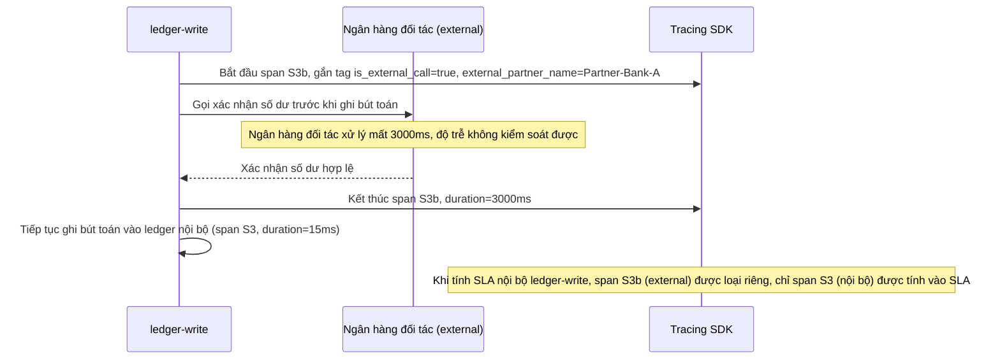

# Sequence Diagram - Enhance: partner-bank-external-call

Đây là flow **enhance mới**: bước `ledger-write` cần xác nhận số dư qua một ngân hàng đối tác bên ngoài trước khi ghi bút toán, span của lời gọi này được đánh dấu `is_external_call=true` kèm `external_partner_name`, để khi tổng hợp SLA nội bộ, độ trễ cao và không kiểm soát được của ngân hàng đối tác không bị tính nhầm vào SLA của chính hệ thống. Đáp ứng yêu cầu 3.

