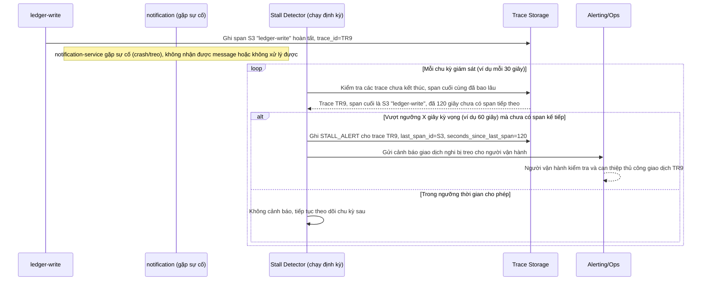

# Sequence Diagram - Enhance: stalled-transaction-alert

Đây là flow **enhance mới**: sau khi span `ledger-write` kết thúc, bước `notification` gặp sự cố nên không có span tiếp theo nào được ghi trong X giây; một tiến trình giám sát định kỳ phát hiện trace "dừng bất thường" giữa chừng và tự động tạo `STALL_ALERT` để người vận hành can thiệp thủ công, thay vì để giao dịch treo âm thầm không ai biết. Đáp ứng yêu cầu 4.

