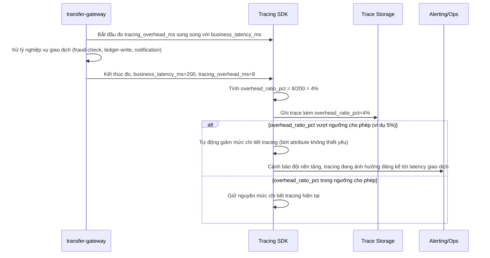

# Sequence Diagram - Enhance: tracing-overhead-budget-check

Đây là flow **enhance mới**: tracing SDK tự đo thời gian nó tiêu tốn thêm (`tracing_overhead_ms`) so với thời gian xử lý nghiệp vụ thật (`business_latency_ms`), tính tỉ lệ overhead so với latency gốc, và so sánh với ngưỡng cho phép (ví dụ 5%) - nếu vượt ngưỡng, hệ thống tự động giảm mức chi tiết tracing (ví dụ bớt số attribute ghi thêm) và cảnh báo đội nền tảng thay vì để tracing âm thầm làm chậm giao dịch thật. Đáp ứng yêu cầu 5.

