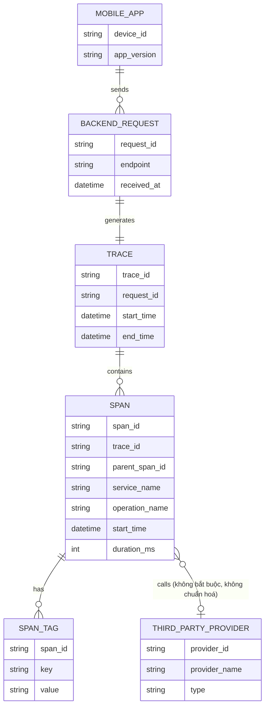

# ERD - Base: Tracing cơ bản trước khi tách bạch external call

Đây là trạng thái **base**, trước khi áp đề bài. Hệ thống đã có tracing phân tán cơ bản (mỗi request từ mobile app sinh 1 trace, trace chứa nhiều span), nhưng span chưa có cấu trúc chuẩn hoá để phân biệt "gọi ra bên thứ ba" với "xử lý nội bộ", chưa ghi nhận số lần retry, chưa tách latency mạng di động của client, và tag của span là key-value tự do không kiểm soát nội dung nhạy cảm. Đây là nền tảng tối thiểu để đề bài (tách span external, gắn tag provider, retry span, alert riêng theo provider, chống rò rỉ PII) "có ý nghĩa" khi so sánh.

Lưu ý: `SPAN` ở base không có field `span_kind` (internal/external), không có `attempt_number` cho retry, và `SPAN_TAG` là key-value tự do, không có whitelist hay quy tắc chống ghi nội dung nhạy cảm — đây chính là những khoảng trống mà enhance sẽ lấp.
