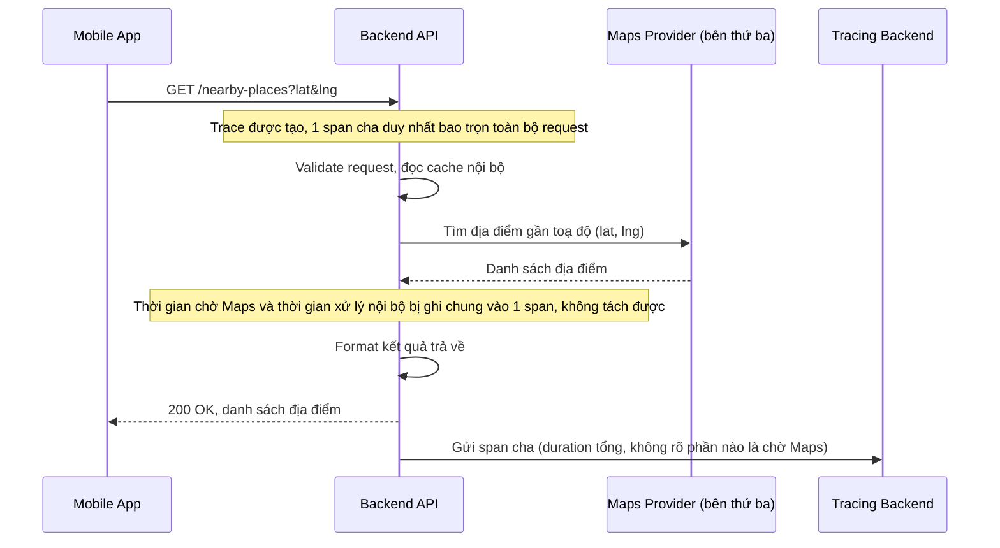

# Sequence - Base: Tra cứu địa điểm gần đây (gọi Maps provider)

Đây là flow **base**: mobile app gọi backend để lấy danh sách địa điểm gần vị trí hiện tại, backend gọi ra dịch vụ bản đồ bên thứ ba. Toàn bộ thời gian (mạng di động, xử lý nội bộ, gọi Maps) bị gộp vào cùng một khối span cha, không tách biệt được phần nào là "chờ Maps" và phần nào là backend tự xử lý. Flow này là tiền đề cho yêu cầu 1 và 2 của đề bài (tách span external có tag provider, và tách latency mạng di động của client).

