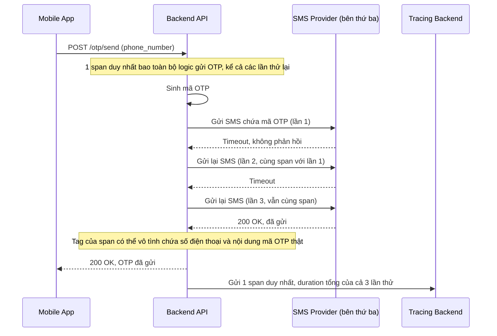

# Sequence - Base: Gửi SMS OTP xác thực (có retry nhưng không tách span)

Đây là flow **base**: backend đã có sẵn cơ chế retry khi gọi dịch vụ SMS bên thứ ba bị timeout hoặc lỗi, nhưng toàn bộ các lần thử được ghi chồng vào cùng một span, không phân biệt được "một cuộc gọi chậm" với "nhiều lần gọi cộng dồn". Đây là tiền đề cho yêu cầu 3 (mỗi lần retry là 1 span riêng kèm số thứ tự) và yêu cầu 5 (không ghi nội dung OTP thật vào tag) của đề bài.

