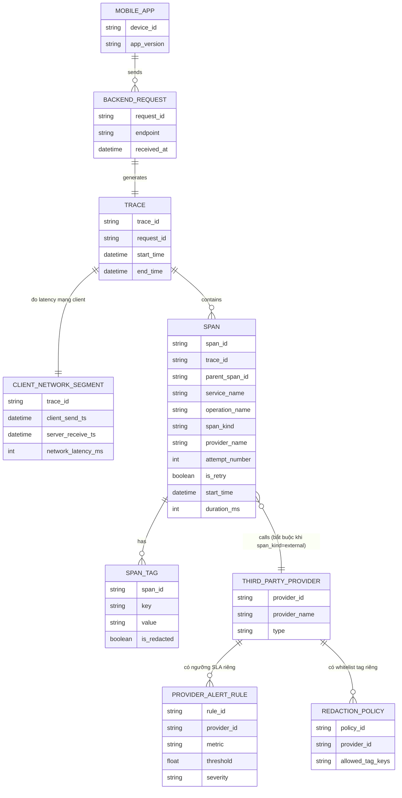

# ERD - Enhance: Span chuẩn hoá cho external call, client network, retry, alert theo provider

Đây là trạng thái **enhance**, sau khi áp toàn bộ đề bài lên base. So với base, các thay đổi chính:

- `SPAN` có thêm `span_kind` (`internal`/`external`), `attempt_number` (số thứ tự lần retry) và `is_retry` — đáp ứng **yêu cầu 1** (tách span external) và **yêu cầu 3** (mỗi lần retry là 1 span riêng).
- Thêm entity `CLIENT_NETWORK_SEGMENT` gắn với `TRACE`, ghi `client_send_ts`/`server_receive_ts` để tính riêng latency mạng di động trước khi tới backend — đáp ứng **yêu cầu 2**.
- `SPAN` liên kết bắt buộc (không còn optional) tới `THIRD_PARTY_PROVIDER` khi `span_kind = external`, và có field `provider_name` ngay trên span để dễ tổng hợp.
- Thêm entity `PROVIDER_ALERT_RULE` (ngưỡng SLA latency/tỷ lệ lỗi riêng theo từng provider) — đáp ứng **yêu cầu 4**.
- Thêm entity `REDACTION_POLICY` quy định whitelist các tag key được phép ghi cho từng loại span/provider, thay cho `SPAN_TAG` tự do ở base — đáp ứng **yêu cầu 5** (không ghi nội dung OTP/toạ độ thật).

