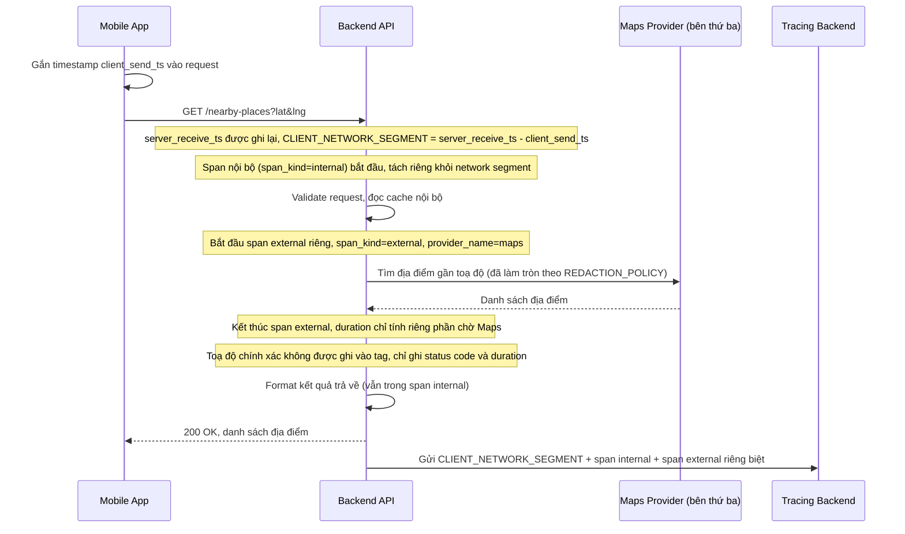

# Sequence - Enhance: Tra cứu địa điểm gần đây (tách client network + external span)

Đây là flow **enhance** của `nearby-places-lookup` (so với base). Khác biệt so với base: span cha được tách thành 1 đoạn network latency riêng của mobile app (client_send_ts vs server_receive_ts), và lời gọi Maps được bọc trong 1 span riêng gắn `span_kind=external`, `provider_name=maps`, tách hoàn toàn khỏi span xử lý nội bộ. Toạ độ chính xác của người dùng không được ghi thẳng vào tag mà chỉ ghi ở dạng đã làm tròn/ẩn danh theo `REDACTION_POLICY`. Đáp ứng **yêu cầu 1, 2 và 5** của đề bài.

